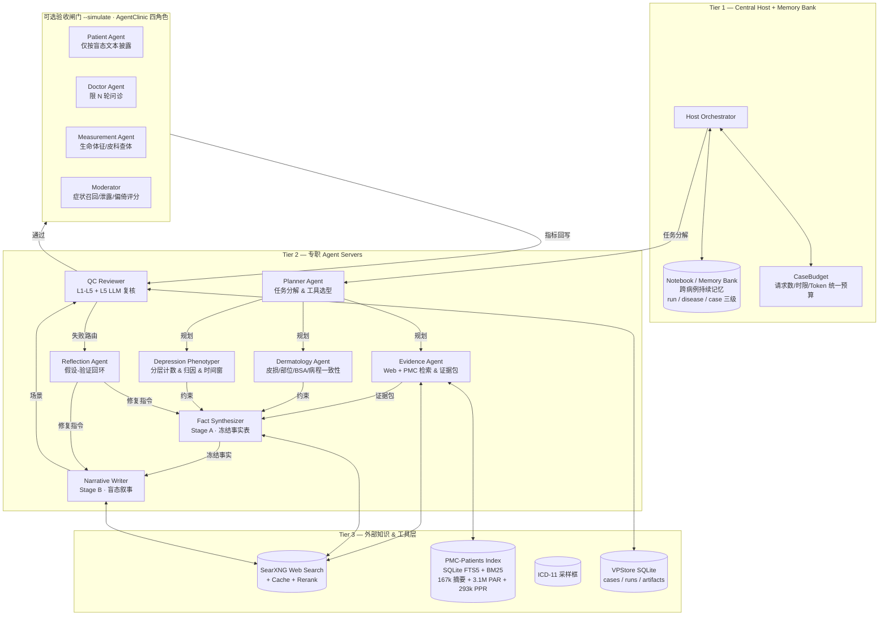

# 虚拟患者生成器的智能体化设计

> 将 `scripts/generate_vp_deepseek31_en.py` (v31, 5926 行) 按 Nature 三篇文献重构为可追溯、可检索、可仿真的多智能体系统，同时以 PMC-Patients (167k 真实病例) 提升临床真实性。
> 分支 `arena/01a0c811-vp-generator`，复用 v31 的 Schema / 五层 QC / SQLite / 导出，不重写单病例契约。

---

## 0. 参考文献如何映射到设计

| 文献 | 核心思想 | 在本系统中的落地 |
|---|---|---|
| **AgentClinic** (`s41746-026-02674-7`, npj Digital Medicine) | 静态 QA 评估与真实临床决策差距巨大；通过 **患者/医生/测量/仲裁四角色** 的多轮对话式 OSCE 仿真评估，要求医生 Agent 在信息不完备下通过有限轮次问诊、申请检查、读片来做决策；引入 **Agent Toolbox**（Notebook 跨病例持续记忆、Adaptive RAG、Reflection CoT、偏倚注入）与患者中心指标（依从性、满意度） | **可选验收闸门 `--simulate`**：用已生成病例的盲态文本驱动四角色仿真，度量症状召回率/泄露率/轮次效率/偏倚敏感性，结果回写 QC 与 `master_table`，不合格可触发定向修复。Notebook 与偏倚探针也直接复用该文工具箱设计。 |
| **DeepRare** (`s41586-025-10097-9`, Nature) | 稀有病诊断的四大难题（多学科、少样本、知识动态更新、需可追溯推理）；提出 **三层 MCP 启发的架构**：带 Memory Bank 的 Central Host 编排、专职 Agent Server 群（表型/基因型/检索各司其职）、异构外部知识工具层；配合 **自反思回环** 迭代验证假设，每一步推理链直接锚定可验证证据 | **三层管线**：`Central Host + Memory Bank` 统筹全程；`Evidence / Phenotype / Dermatology / Fact / Narrative / QC` 六个专职 Agent 各自持有工具子集；`Web 搜索 / PMC-Patients / ICD-11` 为外部知识层；每例均产出 **traceable reasoning chain**（`source_id → claim → snippet → support_reason → fingerprint`）并进入自反思修复回环。 |
| **PMC-Patients** (`s41597-023-02814-8`, Scientific Data) | 从 PubMed Central 抽取 167k 病例摘要，用 **引文图** 自动标注 3.1M 病例-文献关联 (ReCDS-PAR) 与 293k 病例-病例相似度 (ReCDS-PPR)，提出两类检索基准；强调病例多样性与真实世界叙事风格对检索式临床决策支持的价值 | **本地全量索引 + 三重增强**：① PPR 检索相似真实病例作表现型/病程/叙事风格锚点（few-shot）；② PAR 检索关联文献作证据补充；③ 全量人口学分布校准采样骨架并度量合成-真实分布偏移。索引缺失时自动降级，不阻断主流程。 |

> 一句话定位：**DeepRare 的三层与自反思解决“怎么可信地生成”，AgentClinic 的四角色仿真解决“怎么可信地验收”，PMC-Patients 解决“怎么像真的病人”。**

---

## 1. 总体架构

### 1.1 三层 + 四角色鸟瞰



### 1.2 与 v31 的继承关系

```
v31 原有能力（完整保留，不重写）          智能体新增能力
─────────────────────────────          ─────────────────────────
ICD-11 采样框 + 永久 index_map  ──────▶  Host 复用，index_map 仍为唯一真源
Skeleton 采样                  ──────▶  经 PMC 人口学分布校准
两阶段生成 (Stage A 事实 / Stage B 叙事) ─▶  拆为 Fact / Narrative 两个 Agent
SearXNG 检索 + SearchLedger + 去重   ──▶  封装为 WebSearchTool，归 Evidence Agent 持有
Pydantic Schema + canonicalize     ──▶  完整复用，增加 PMC 风格一致性校验
L1-L4 确定性 QC                   ──▶  封装为 QCReviewer 前四层
L5 LLM 综合复核                   ──▶  Reflection Agent + L5 Reviewer，产出可追溯推理链
SQLite + 版本化 artifact + 导出    ──▶  完整复用，新增记忆库与仿真指标列
CaseBudget / 限流 / 重试          ──▶  Host 统一持有，跨 Agent 共享
```

> **不变量**：`ICD-11 code`、`age_band` 内的 `age_years`、`sex/edu/occupation/marital/ses` 五字段仍由骨架一次性采样后 **逐字复现**，任何替换均视为生成错误而非静默纠正；`A3/A4/A5/A6/A8` 仅 `mood/mixed` 计入 `additional_count`，`skin/other/none` 不计数的归因规则保持不变。

---

## 2. Central Host 与 Memory Bank

### 2.1 Host 职责（DeepRare Host 范式）

- **唯一预算持有者**：持有 `CaseBudget(max_requests, deadline, token_ceiling)`，所有 Agent 的 `ApiSession` 共享同一预算对象，`spend_request()` 原子递增，`remaining_requests <= reserve` 时提前熔断。
- **任务分解**：接收 `(disease, severity, vp_index)` 元组，输出 DAG：`EvidenceGathering → FactSynthesis → NarrativeWriting → QC → [Reflection → 修复] → [SimulationGate]`。
- **工具调度**：按阶段授予最小工具集——Stage A 允许 `web_search + pmc_retrieve`，Stage B 禁止任何检索（`tool_choice=none`），仿真阶段仅允许 `measurement_request`。
- **证据统一**：维护单例 `SearchLedger`（`S001` 递增、`by_url` 去重、`adopt_pack` 复用），所有 Agent 引用同一套 `source_id`，杜绝伪造 URL。
- **审计**：每次 LLM 调用、每次检索、每次 QC 裁决均写入 `vp_output/audit/{run_id}/{vp_index}/`，与 v31 审计目录兼容。

### 2.2 Memory Bank / Notebook（AgentClinic Notebook）

三级记忆，跨病例持久化于 SQLite (`notebooks` 表) + 文件镜像：

| 层级 | 作用域 | 写入内容 | 读取时机 |
|---|---|---|---|
| **Run-level** | 单次 `run_id` | 本次运行的检索失败模式、L5 高频修复意见、证据包命中率 | Host 规划下一例时 |
| **Disease-level** | `icd11_code` | 该病的 PASI/BSA 典型区间、常用治疗与应答、PMC 检索到的高频表现型 | Evidence / Dermatology Agent 生成检索词时 |
| **Case-level** | `vp_index` | 本例的 `ledger`、`qc.warnings`、`simulation_metrics` | Reflection 路由时 |

> Llama-3 在 AgentClinic 中借助 Notebook 相对提升可达 92%——本系统将同类增益用于证据检索词的跨例优化与叙事去同质化（`prompt_perturbation_seed` 仍独立）。

两类提示词注入：

- **Adaptive RAG (PMC)**：`relevant_articles` 的标题/摘要前 240 字符作为 RAG 上下文，限 8 条。
- **Adaptive RAG (Web)**：SearXNG 结果的已验证 `source_id` 列表，Stage A 提示词中以 `source_id=S001` 无括号形式列出（避免教模型写 `[S001]` 而被 QC 判伪造）。

---

## 3. 专职 Agent 详表

| Agent | 输入 | 持有工具 | 输出 | 复用 v31 组件 |
|---|---|---|---|---|
| **Planner** | `skeleton` + Memory | `icd11_lookup` | DAG + 检索计划（英文检索词 ≤7 词） | `sample_skeleton`, `matrix_to_prompt` |
| **Evidence Agent** | 疾病名 + 检索计划 + Memory | `web_search`, `pmc_retrieve`, `pack_load/save` | `SearchLedger` + `EvidencePack` + `pmc_context` | `SearchLedger`, `EvidencePackStore`, `_searxng_web_search` |
| **Dermatology Agent** | `ledger` + `pmc_context` + ICD-11 definition | 只读 `ledger` | 皮损形态/部位/BSA/NRS/病程/治疗的事实约束 | `SkinProfile` 校验 |
| **Depression Phenotyper** | `severity` + `matrix_to_prompt` | 无 | 计数、归因、时间窗、功能损害的判定规则 | `SEVERITY_MATRIX`, `resolve_rule_severity` |
| **Fact Synthesizer (Stage A)** | skeleton + 约束 + ledger | `web_search` (限 2 次) | `VPCase` (facts frozen, `first_person_narrative` 占位) | `build_stage_a_prompt`, `canonicalize`, `stage_a_qc` |
| **Narrative Writer (Stage B)** | frozen `VPCase` + ledger | 无检索 | `<<<CASE_SCENARIO>>>` 8 段 | `build_stage_b_prompt`, `narrative_section_contract` |
| **QC Reviewer** | `VPCase` + scenario + ledger | 只读 | `QCReport` (L1-L5) + `verified` 计数 + `repair_target` | `run_qc`, `verify_evidence`, `l5_comprehensive_review` |
| **Reflection Agent** | `QCReport` + ledger | `web_search` (定向补检 ≤2 次) | 修复指令（`stage_a`/`stage_b`）+ 补充检索 | `review_evidence`, `EvidencePackStore` |
| **Simulator (4 角色，见 §5)** | blinded scenario | `measurement` | `simulation_metrics` | `blinded_scenario`, `split_scenario` |

**执行顺序**（单例 `CaseBudget` 贯穿）：

```
Planner → Evidence (PMC + Web 并行, 去重) → Fact (Stage A, tool_choice=auto, 限 2 次检索)
       → QC-A (L1-L3) → Narrative (Stage B, tool_choice=none)
       → QC-B (L1-L5) → Reflection (若 repair, 定向补检后回到 Fact 或 Narrative, 共享预算)
       → SimulationGate (若 --simulate, 见 §5)
       → Commit (VPStore 事务提交)
```

---

## 4. 工具层详细设计

### 4.1 Web Search Tool（复用 v31 SearXNG 层）

- **签名**：`web_search(query: str) -> List[{source_id, url, title, snippet}]`
- **实现**：`_searxng_web_search_impl` + `_filter_and_rerank_search` + `SEARCH_CACHE`，保持 `PREFERRED_SOURCE_DOMAINS` 加权与 `BLOCKED_SOURCE_DOMAINS` 过滤。
- **约束**：Stage A 最多 2 次调用（补充修复时再加 2 次），英文检索词 ≤7 词，`SEARXNG_BASE_URL_LIST` 负载均衡，去重后注册到 `SearchLedger`。

### 4.2 PMC-Patients Tool（新增，全量索引）

#### 4.2.1 数据结构（167k 摘要，源自 Figshare/HF）

单条记录（`PMC-Patients.json`）：

```json
{
  "patient_id": "0",
  "patient_uid": "31402642-0",
  "PMID": "31402642",
  "file_path": "PMC/PMC6704996/...xml",
  "title": "Case report title",
  "patient": "A 34-year-old male presented with ...",
  "age": [[34.0, "year"]],
  "gender": "M",
  "relevant_articles": {"31402642": 2, " ...": 1},
  "similar_patients": {"31402642-1": 2}
}
```

#### 4.2.2 本地索引管线（`scripts/build_pmc_index.py` / `vp_agent/tools/pmc_patients.py`）

```
下载 (figshare 195 MB tar.gz / HF 1.38 GB)
  → 解压 PMC-Patients.json (167034 行)
    → 过滤：length>=10 词 / language<3% 非英文 / 含 age+gender
      → 规整：age 统一为岁、gender M/F、patient 文本清洗
        → 建库：SQLite + FTS5 + 年龄/性别/疾病关键词倒排
          → 产物：pmc_patients.sqlite (~ 400 MB) + pmc_index_meta.json
```

建库选项：

- **全量模式**（默认）：167k 全入，支持任意疾病检索。
- **皮肤科子集**：按标题/摘要关键词 `dermatolog|psoriasis|eczema|atopic|acne|vitiligo|melanoma|dermatitis|urticaria|alopecia|lichen|pemphig|blister` 预筛，约 8-12k，体积小 10 倍，适合资源受限环境。
- **缺失降级**：索引不存在时 `PMCPatientsStore.search()` 返回 `[]` 并打 `logger.warning`，Evidence Agent 仅用 Web 搜索继续，`evidence_basis` 标记 `pmc_unavailable`。

#### 4.2.3 检索接口

```python
class PMCPatientsStore:
    def search_similar_patients(self, query: str, k: int = 5,
                                age_band: str | None = None,
                                gender: str | None = None) -> List[PatientHit]: ...

    def search_relevant_articles(self, query: str, k: int = 5) -> List[ArticleHit]: ...

    def age_gender_distribution(self, disease_hint: str | None = None) -> Dict: ...

    def get_style_anchors(self, disease_hint: str, k: int = 3) -> List[str]: ...
```

- **PPR 检索**：对 `patient` 文本的 FTS5 BM25 排序，可选按 `age_band/gender` 过滤，用于叙事风格锚点与病程真实性校验。
- **PAR 检索**：通过 `relevant_articles` 展开 PMID，返回标题/摘要（需另配 PubMed 摘要库或用引文标题占位），用于证据补充。
- **分布校准**：`age_gender_distribution()` 返回真实人群的年龄中位数、四分位数与性别比，供 `sample_skeleton` 偏态校正与合成-真实分布的 χ²/KS 检验。

#### 4.2.4 如何增强临床真实性（对接生成管线）

| 增强维度 | 注入点 | 具体做法 |
|---|---|---|
| **表现型真实性** | Evidence Agent → Fact 提示词 | 检索 top-3 相似真实病例的 `patient` 摘要（截断 240 字符）作为 `pmc_context` 注入 Stage A，要求皮损形态/部位/病程与真实病例一致性自检 |
| **叙事风格真实性** | Narrative 提示词 | 抽 2 条真实病例的首句叙事风格作 few-shot 锚点，配合 `prompt_perturbation_seed` 去同质化，同时受 `homogeneity_report` 0.85 阈值约束 |
| **人口学真实性** | Skeleton 采样 | 用真实年龄/性别分布校准 `AGE_BAND_WEIGHTS`/`SEX_WEIGHTS`（可选开关 `--pmc-calibrate`），并在 `master_table` 新增 `pmc_age_gender_match` 列度量偏移 |
| **证据真实性** | Stage A 证据 | PAR 检索的关联文献与 Web 搜索结果合并去重，统一经 `SearchLedger` 与 `verify_evidence` 的 `support_reason` / `fingerprint` 校验 |
| **可追溯性** | 审计 | 每例保存 `pmc_hits`（`patient_uid`、BM25 分、引用 PMID）至 `raw_payload.pmc_context`，与 `evidence_sources` 并列可审 |

---

## 5. 可选仿真验收闸门（AgentClinic 四角色）

> **设计原则**：默认关闭以节省 token/成本；`--simulate` 显式开启后才增加每例 1-2 次 LLM 调用。结果写入 QC 报告与 master table 新列，不合格可触发定向修复，但不改变已冻结事实的医学真值，仅修复叙事与归因表达。

### 5.1 角色定义

| 角色 | 系统提示要点 | 信息可见性 |
|---|---|---|
| **Patient Agent** | 仅按盲态文本披露；未被问及时不主动提及抑郁症状；对阴性症状给出自然否认句；不泄露 `Ideal Management`/`Depression symptom layer` | `blinded_scenario`（6 段）+ `First-person narrative` |
| **Doctor Agent** | 限 N=20 轮问诊内完成信息采集与诊断假设；可申请测量与影像判读 | 仅通过对话获得信息 |
| **Measurement Agent** | 按需返回生命体征/皮科查体/可观察精神状态，不下诊断结论 | 固定检查模板 |
| **Moderator** | 对照 `answer_key` 评分症状召回、泄露、诊断一致性 | 全量 `VPCase` + `scenario` |

### 5.2 仿真流程

```
blinded_scenario ──▶ Patient Agent (stateful, 记忆已披露信息)
                         ↕  N ≤ 20 轮 (doctor 问 / patient 答)
Doctor Agent ──▶ Measurement Agent (按需)
                         │
                         ▼
                   Moderator 评分
                         │
              ┌──────────┼──────────┐
              │          │          │
         症状召回率  泄露/偏倚  患者中心指标
         (per-domain) (L4 类)  (依从性/满意度/复诊意愿)
              └──────────┼──────────┘
                         ▼
              simulation_metrics 回写 QCReport + master_table
              若 recall<阈值 或 泄露 → Reflection 定向修复 Stage B
```

### 5.3 指标（写入 `master_table` 新增列）

| 指标 | 定义 | 阈值/用途 |
|---|---|---|
| `sim_symptom_recall` | 每域 `present:true` 是否在对话中被显式引出（`observed_present==true` 的 L5 语义对照） | <0.8 触发 Stage B 修复（补充 elicitable 叙事） |
| `sim_leakage` | 盲态对话中是否出现量表题干/泄露标签（L4 规则复用） | 任何泄露 → Stage B 修复 |
| `sim_turns_used` | 实际问诊轮次 | 记录效率，供 Notebook 优化 |
| `sim_compliance` / `sim_satisfaction` | 5 级 Likert，Patient Agent 自评 | 研究用，不作硬性阈值 |
| `sim_bias_probe` | 注入偏倚（如 recency/anchoring）前后的召回差 | 偏倚敏感性分析 |

> 偏倚注入（AgentClinic 23 种）通过给 Doctor/Patient Agent 追加系统提示实现，例如 `recency_bias: "Recently you saw a similar rash you diagnosed as ..."`，用于测量诊断准确率下降幅度。

---

## 6. 自反思与可追溯推理链（DeepRare Reflection）

### 6.1 推理链 Schema

```json
{
  "chain_id": "VP-000001@reflect-01",
  "hypotheses": [
    {"disease": "Psoriasis EA90", "confidence": 0.82, "evidence": ["S001", "S003"]},
    {"disease": "Atopic dermatitis EA80", "confidence": 0.31, "evidence": ["S002"]}
  ],
  "steps": [
    {"claim": "Well-demarcated scaly plaques on elbows/knees", "source_id": "S001",
     "snippet": "psoriasis typically presents as ...", "support_reason": "supported", "fingerprint": "sha256:..."},
    {"claim": "PASI 11.4 moderate", "source_id": "S003", "snippet": "...", "support_reason": "supported"}
  ],
  "reflection": {"verdict": "repair", "target": "stage_a", "reason": "BSA 25% 与 low visibility 矛盾"}
}
```

- 每条 `claim` 均经 `verify_evidence` 的 `support_reason` 与 `evidence_fingerprint` 校验，未验证的 `gap/unverified` 不计入 `MIN_VERIFIED_SOURCES`。
- L5 产出的 `checks`（4 域）与 `doubt_resolutions`（per-symptom 文本-表格对照）即为可追溯推理链的人审视图，要求 **逐条 quote 逐字命中原文**，否则判 `invalid`。

### 6.2 反思回环

```
QC 失败 ──▶ Reflection Agent 分类
               ├─ 症状/时间/归因矛盾  ──▶ 靶向 Stage B 修复（仅改叙事，不改事实）
               ├─ 证据不足/不支持    ──▶ 定向补检 (≤2 次) + Stage A 重生成
               └─ 泄露/措辞          ──▶ Stage B 重写 + L5 逐条 quote 自检
         ──▶ 重新进入 QC，全程共享 CaseBudget
```

`MAX_L5_REPAIRS=2`，`MAX_EVIDENCE_SEARCH_ROUNDS=2`，任何 `BatchFatalError` 直接上抛，不计入病例重试。

---

## 7. 文件清单与运行方式

### 7.1 新增/改动文件

```
vp_agent/                          # 新增智能体包
  __init__.py
  config.py                        # 复用 v31 的 _env_* / 常量 / provider_of
  memory.py                        # Notebook 三级记忆
  tools/
    web_search.py                  # SearXNG 封装
    pmc_patients.py                # PMC-Patients 索引与检索
    icd11.py                       # ICD-11 采样框封装
  agents/
    base.py
    host.py                        # Central Host + CaseBudget
    evidence.py                    # 证据检索 Agent
    fact.py                        # Stage A
    narrative.py                   # Stage B
    qc.py                          # L1-L5
    simulator.py                   # 四角色仿真闸门
  pipeline.py                      # 单例/批量编排，复用 VPStore
  cli.py                           # python -m vp_agent 入口
  prompts/system_prompts.py        # 各 Agent 系统提示

scripts/build_pmc_index.py         # 独立索引构建脚本

docs/agentic_design.md             # 本文档

scripts/generate_vp_deepseek31_en.py  # 保持不变，作为底层引擎
requirements.txt                   # 新增 datasets / rank-bm25 可选依赖
```

### 7.2 运行

```bash
# 1) 安装（复用 v31 依赖，新增可选）
pip install -r requirements.txt
# 可选：启用 PMC 检索需本地索引
pip install datasets rank-bm25   # 可选，缺失时自动降级为 FTS5/关键词

# 2) 准备 ICD-11 采样框（与 v31 相同）
cp icd11_skin_diseases.json.example icd11_skin_diseases.json  # 占位

# 3) 构建 PMC 索引（需先下载 PMC-Patients.json，沙箱离线环境跳过则自动降级）
python scripts/build_pmc_index.py \
  --source /data/PMC-Patients.json \
  --out vp_output/pmc_patients/pmc_patients.sqlite \
  --mode full          # 或 --mode derm_subset

# 4) 生成（默认不含仿真，与 v31 行为一致，额外产出 pmc_context 审计）
python -m vp_agent --n 5 --model deepseek-v4-pro-0813

# 5) 启用 PMC 校准与仿真验收
python -m vp_agent --n 5 --pmc-index vp_output/pmc_patients/pmc_patients.sqlite \
  --pmc-calibrate --simulate --simulate-turns 20

# 6) 构建证据包复用（与 v31 EvidencePackStore 兼容）
python -m vp_agent --all --pmc-index vp_output/pmc_patients/pmc_patients.sqlite

# 7) 离线自检（无 API key / 无网络）
python -m vp_agent --selfcheck
/home/user/.venv/bin/python scripts/generate_vp_deepseek31_en.py --selfcheck  # v31 原生自检仍可用
```

环境变量（继承 v31，新增 `PMC_*`）：

```
DEEPSEEK_API_KEY / DEEPSEEK_MODEL / DEEPSEEK_BASE_URL
SEARXNG_BASE_URL_LIST / ENABLE_WEB_SEARCH / SEARCH_CACHE_PATH
VP_OUTPUT_DIR / VP_DB_PATH / ICD11_PATH
PMC_INDEX_PATH / PMC_CALIBRATE=0/1 / PMC_TOPK=5
SIMULATE=0/1 / SIM_TURNS=20 / SIM_BIAS=""
```

### 7.3 导出与审计

- `VPStore` 仍为唯一真源，`master_table` 再生、`index_map` 永久、`artifact_version` 递增均不变。
- 新增列：`pmc_hits`（JSON）、`pmc_age_gender_match`、`sim_symptom_recall`、`sim_leakage`、`sim_turns_used`、`sim_compliance`。
- 审计目录新增 `audit/{run_id}/{vp_index}/pmc_retrieval.json` 与 `simulation/`.

---

## 8. 评测建议

| 维度 | 指标 | 基线 |
|---|---|---|
| 临床真实性 | 专家盲审真实感 / `homogeneity_report` TF-IDF 余弦 <0.85 / 合成-真实年龄/性别分布 χ² | v31 无 PMC 时 vs 有 PMC 时 |
| 证据可追溯性 | `verified_sources >=2` 达成率 / L5 `95.4%` 式专家一致性抽检 | DeepRare 报告值 |
| 仿真验收 | 症状召回率 / N 轮内完成率 / 偏倚注入前后准确率差 | AgentClinic 62.1% (Claude-3.5) 等 |
| 效率 | 每例请求数/Token/时延 / EvidencePack 复用率 | v31 `CaseBudget` 上限内 |

---

## 9. 风险与降级

| 风险 | 缓解 |
|---|---|
| PMC-Patients 离线/未下载 | 检索返回空，Evidence Agent 仅用 Web 搜索，`evidence_basis=pmc_unavailable` 并打 warning |
| 引文图噪声（PMC 3.1M 关联含间接引用） | `verify_evidence` 的 `support_reason` 与 L5 quote 逐字校验过滤不支持的 claim |
| 跨病例记忆污染 | Notebook 分 `run/disease/case` 三级隔离，Disease-level 仅存去标识化的区间与模板 |
| 仿真成本 | 默认关闭；开启时 `reserve_requests=1` 预留，超限直接产出并标记 `sim_incomplete` |
| 泄露误判 | L4 规则区分 `Actor scaffolding`（Additional information 内的 `A1:` 仅 warning）与患者可见区泄露（error） |

---

*本文档与 `vp_agent/` 代码同版本发布，后续改动以 `GENERATOR_VERSION` 与 `prompt_digest()` 为准。*
